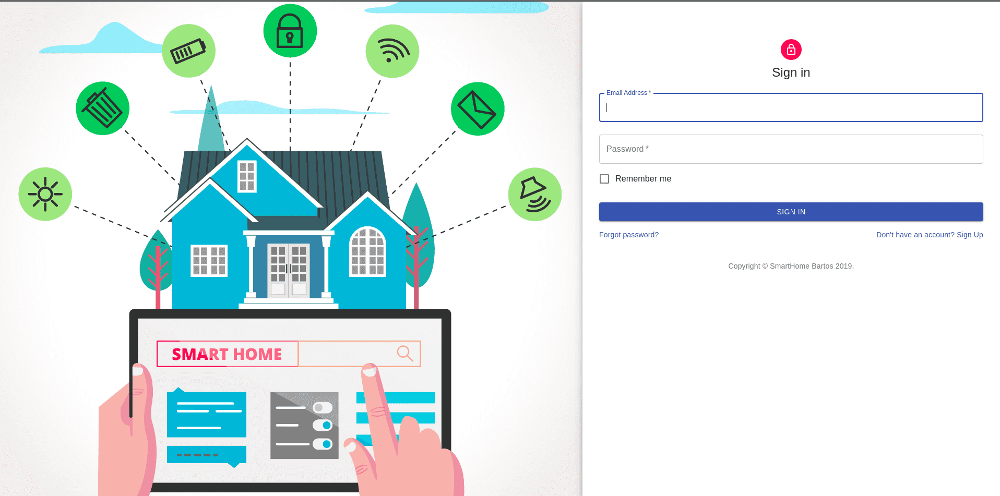

# HOW TO RUN

Please follow this steps to successfully run the apps.

## Backend

First, you have to execute this command from this directory.

```
cd backend/
mvn springboot:run
```

Backend should run on port 8080, in case the port is used, the port is contained in server log.
So, now the server listen on ``localhost:8080``.

Database is PostgreSQL. You have to add props ``application.properties`` to /src/main/resources. 
The file is confidential.


## Frontend

```
cd frontend/
npm install
npm start
```

Backend should run on port 3000, in case the port is used, the port is contained in log.
So, now the frontend is running on ``localhost:3000``.

## UI example

#### Sign in



#### Dashboard Homes


